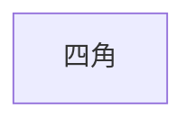
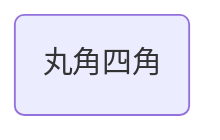
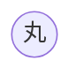
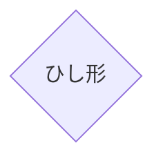

# Hello Mermaid
## Mermaidとは
- UMLを描画するためのツール
- PlantUMLとは違い実行環境が楽
  - PlantUMLにはJavaの実行環境が必要
  - PlantUMLの方がもっと便利なことができる
  - 手軽に書くならMermaid
- 実行環境はJavaScript
---
## 図形 
### 四角

### 丸角四角

### 丸

### ひし形

### リボン
