# Hello Mermaid
## Mermaidとは
- UMLを描画するためのツール
- PlantUMLとは違い環境構築が楽
  - PlantUMLにはJavaの実行環境が必要
  - PlantUMLの方がもっと便利なことができる
  - 手軽に書くならMermaid
- 実行環境はJavaScript
---
## 図形 
### 四角
```
ID["四角"]
```
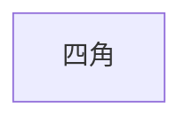
### 丸角四角
```
ID("丸角四角")
```
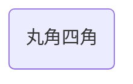
### 丸
```
ID(("丸"))
```
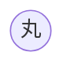
### ひし形
```
ID{"ひし形"}
```
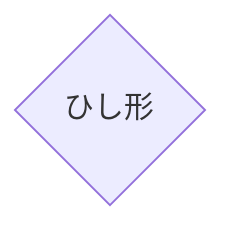

### 六角形
```
ID{{"六角形"}}
```
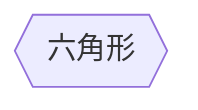
### リボン
```
ID>"リボン"]
```
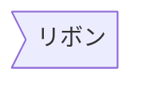

### 円柱
```
ID[("円柱")]
```
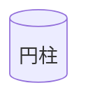

### 両サイド円
```
ID(["両サイド円"])
```
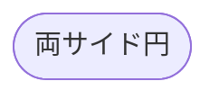

### 両サイド二重線
```
ID[["両サイド二重線"]]
```
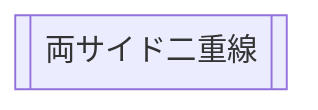

### 平行四辺形
```
ID[/"平行四辺形"/]
ID2[\"平行四辺形"\]
```
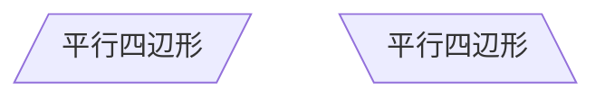

### 台形
```
ID[/"台形"\]
ID2[\"台形"/]
```
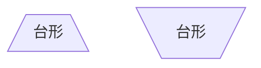