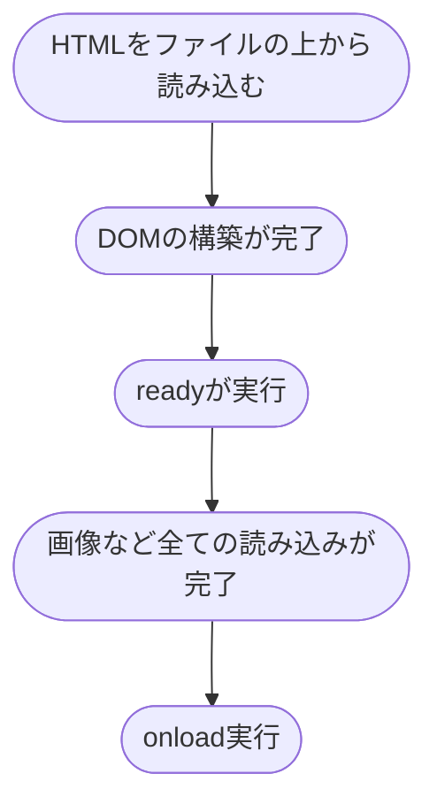

# JavaScriptの`ready`と`onload`の説明
- `ready`
  - DOMが構築が終わってから実行される
- `onload`
  - 画像ファイルなど全てのコンテンツの読み込みが終わってから実行される
  - `window.onload = e => {}`のやつ
  - `window.addEventLisntener('load', e => {})`もある
- `ready`の方が先に実行される
# 図
