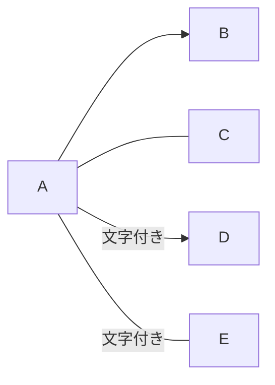
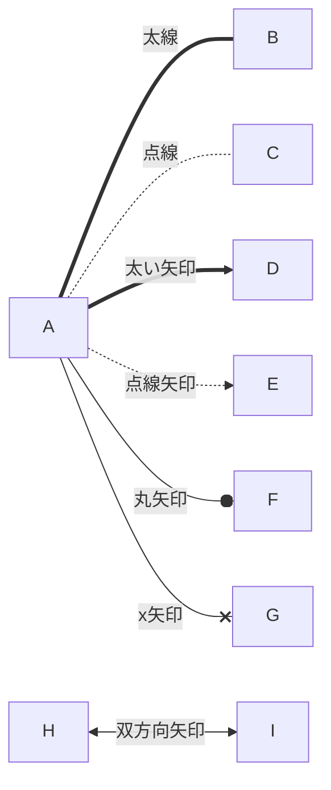

# 矢印いろいろ
## 例１
```
flowchart LR
A --> B
A --- C
A -->|文字つき| D
A -- 文字つき --- E
```

## 例２
```
 A == 太線 === B
    A -. 点線 -.- C
    A == 太い矢印 ==> D
    A -. 点線矢印 .-> E
    A -- 丸矢印 --o F
    A -- x矢印 --x G
    H <--> |双方向矢印| I
```
