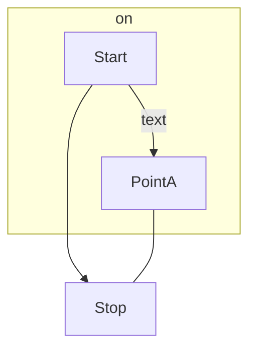
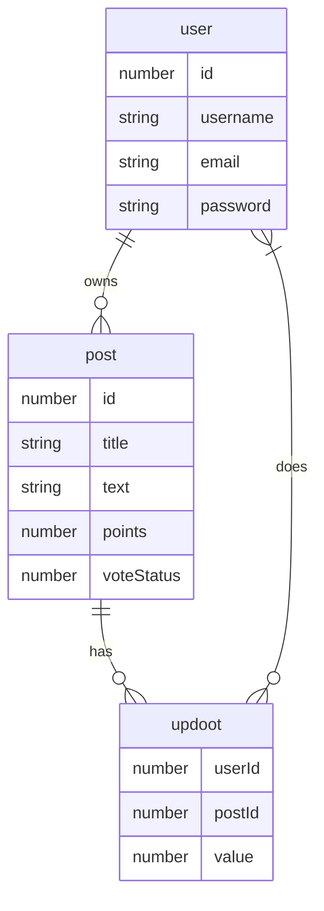
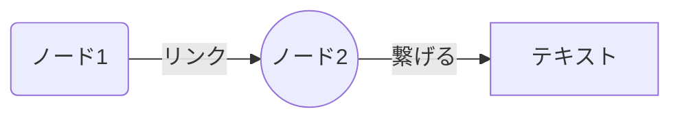

# Test

```mermaid
flowchart TD
    Start --> Stop
    subgraph on
    Start --> |text|PointA
    end
    PointA --- Stop
```

```mermaid
erDiagram

user ||--o{ post : owns
post ||--o{ updoot : has
user }|--o{ updoot : does

user {
  number id
  string username
  string email
  string password
}

post {
  number id
  string title
  string text
  number points
  number voteStatus
}

updoot {
  number userId
  number postId
  number value
}
```

```mermaid
graph LR
  ID1("ノード1") -- "リンク" --> ID2(("ノード2"))
  ID2 --"繋げる"--> ID3["テキスト"]
```